# Lin 的学习圈子

用户中心系统，基于Spring Boot后端＋React前端的全栈项目，实现了用户注册、登录、查询等基础功能。
管理员可对用户进行增删改查操作，用户可以修改自己的信息。

## 技术选型
- Java编程语言
- Spring + SpringMVC + SpringBoot框架
- MyBatis + MyBatis Plus 数据访问框架
- MySQL 数据库
- jUnit单元测试库

## byLiLin

### 登录界面

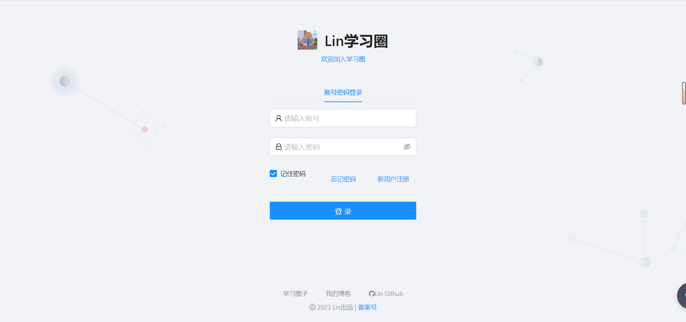

### 注册界面

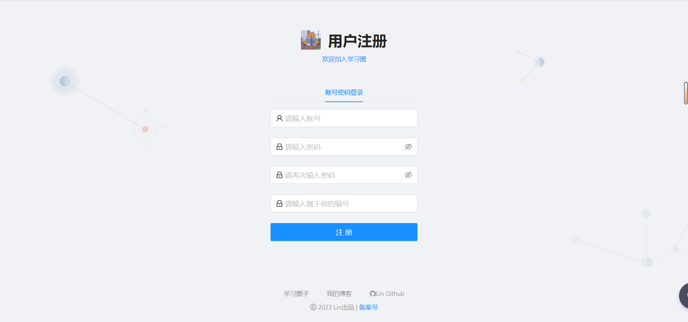

### 首页

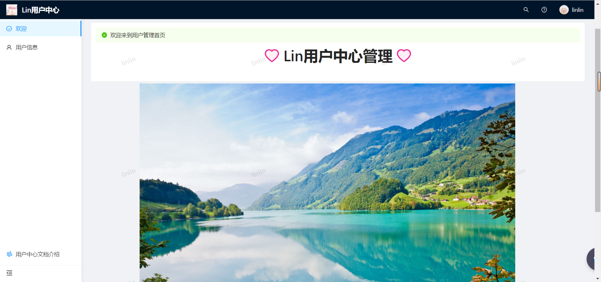

### 用户管理界面

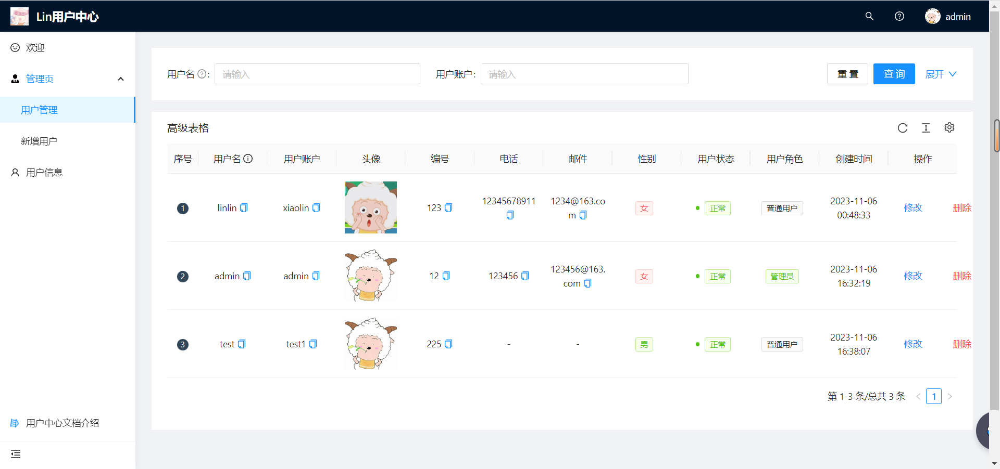

### 用户信息界面

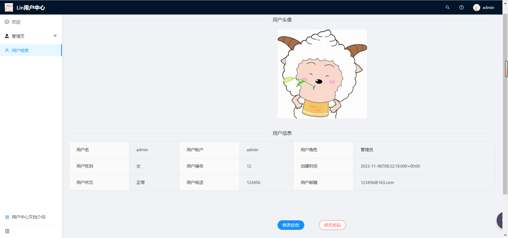

### 用户新增界面

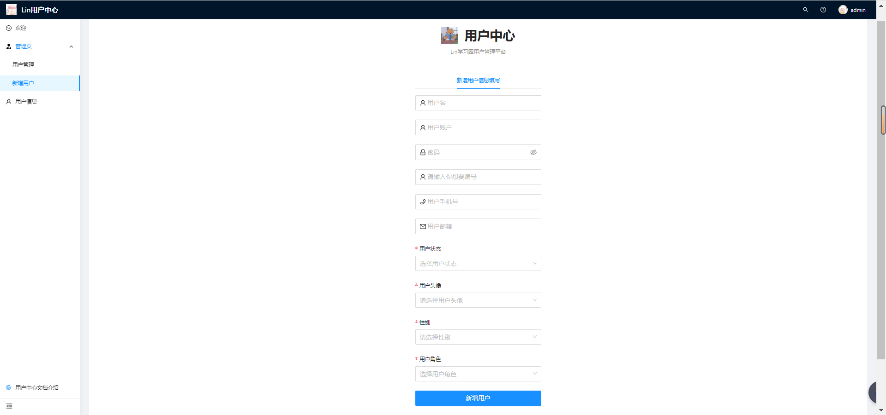

### 用户修改自己信息

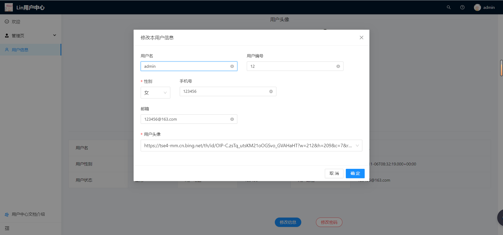

### 用户修改密码

### 管理员修改用户信息

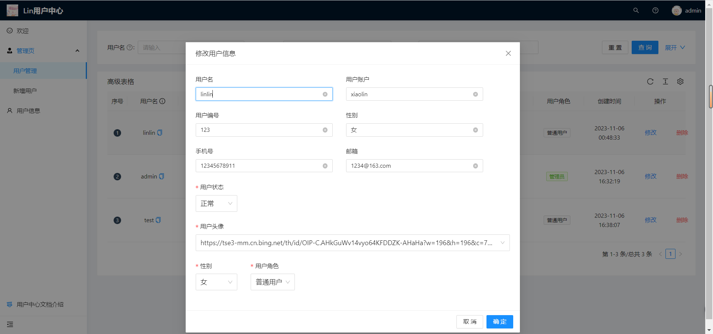

### 管理员查询用户

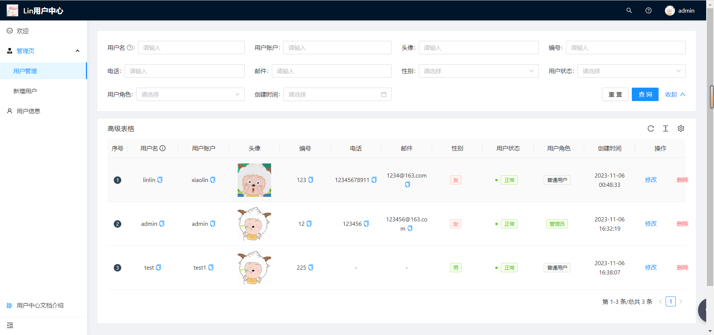

### 管理员删除用户

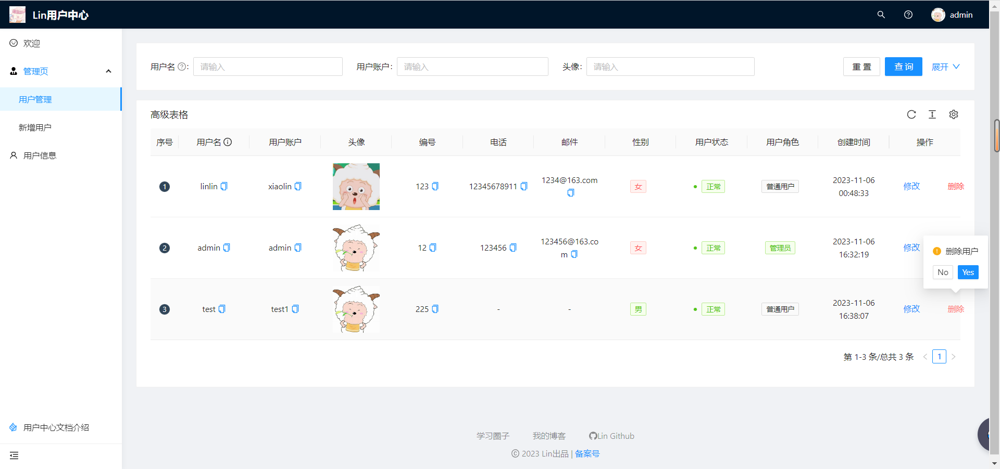

### 后端接口访问

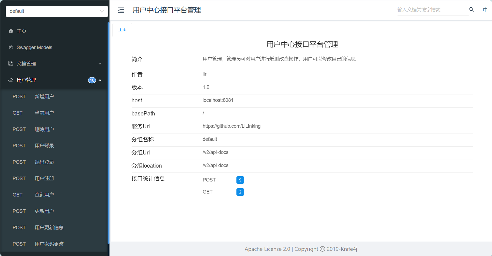
